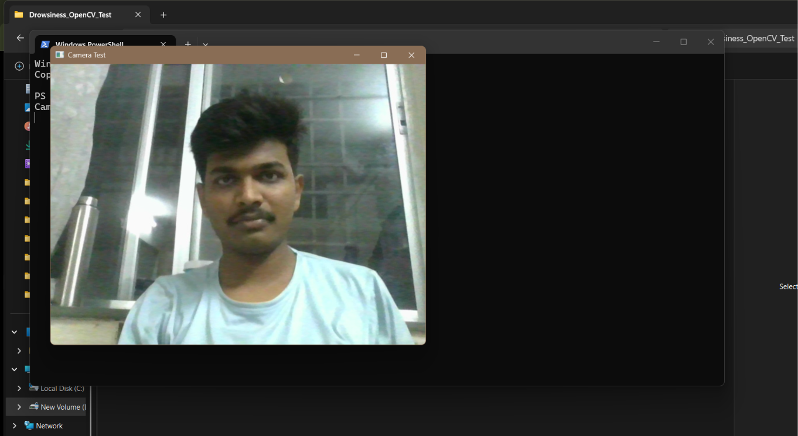
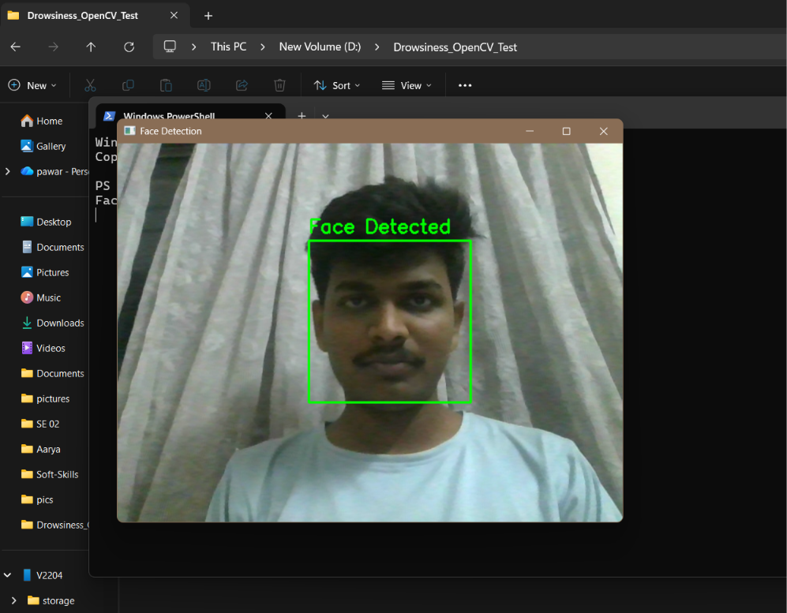
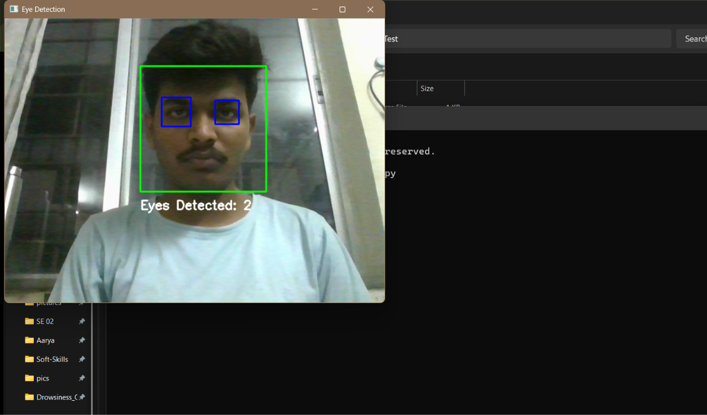
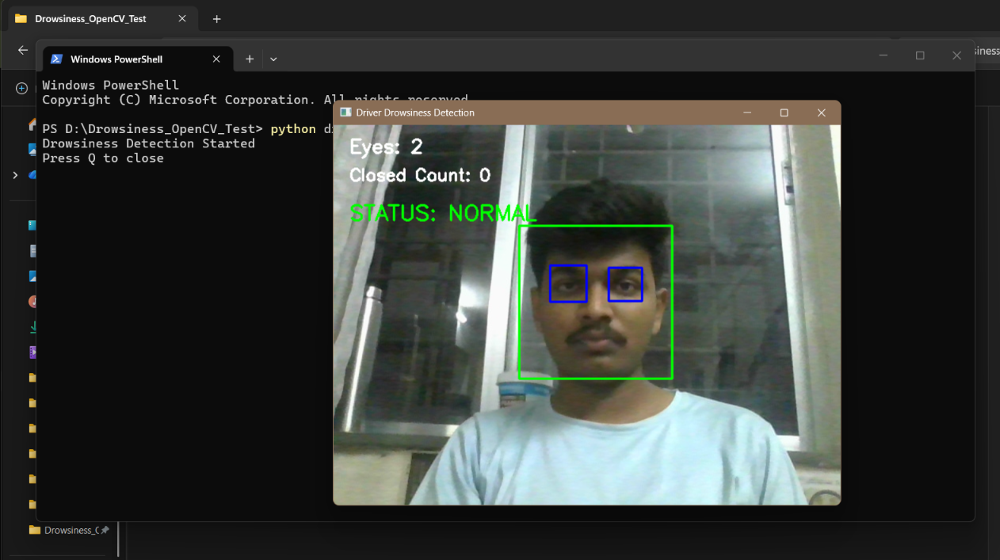
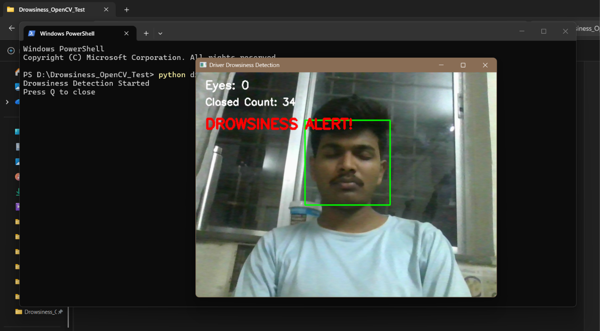

# Smart Driver Drowsiness Detection & Alert System

A simulation based Driver Drowsiness Detection and Alert System developed using OpenCV, Python, Arduino simulation, and KiCad PCB design.

The project demonstrates how computer vision can be used to detect a driver's eyes and identify possible drowsiness, while an embedded alert circuit provides LED and buzzer indications.

---

##  Project Overview

Driver drowsiness is a major safety concern while driving. This project demonstrates a basic system that monitors the driver's face and eyes using a camera.

The system detects the face, detects the eyes, and monitors whether the eyes remain undetected for a certain period. If prolonged eye closure is detected, the system generates a drowsiness alert.

The project was developed completely as a simulation and learning project without physical hardware.

---

##  Objectives

- Detect the driver's face using a camera.
- Detect the driver's eyes using OpenCV.
- Identify possible drowsiness based on eye detection.
- Generate an alert when drowsiness is detected.
- Simulate an LED and buzzer alert circuit.
- Design a PCB for the alert circuit using KiCad.
- Understand the complete development flow from simulation to computer vision.

---

##  System Architecture

```text
Camera
   ↓
Python + OpenCV
   ↓
Face Detection
   ↓
Eye Detection
   ↓
Eye Closure Monitoring
   ↓
Drowsiness Decision
   ↓
Drowsiness Alert

```

## Working Principle
### 1. Camera Input
The system captures live video using the computer's camera.

### 2. Face Detection
OpenCV's Haar Cascade classifier detects the driver's face.

### 3. Eye Detection
The detected face region is analyzed to detect the eyes.

### 4. Drowsiness Detection
The system continuously checks whether the eyes are detected.

If the eyes are not detected for a predefined number of frames, the system considers the driver to be drowsy.

### 5. Alert
When drowsiness is detected, the system displays a warning message and produces an audible alert.

---

## Technologies & Tools Used
- Python
- OpenCV
- Haar Cascade Classifier
- Arduino
- Wokwi
- KiCad
- Computer Vision
- PCB Design
- Gerber File Generation

---

## Project Structure
```text
Driver_Drowsiness_Detection/
│
├── README.md
│
├── Wokwi_Simulation/
│   ├── diagram.json
│   ├── sketch.ino
│   └── wokwi-project.txt
│
├── KiCad_PCB/
│   ├── Driver_Drowsiness_System.kicad_pcb
│   ├── Driver_Drowsiness_System.kicad_pro
│   ├── Driver_Drowsiness_System.kicad_sch
│   └── Gerber/
│
└── OpenCV_Drowsiness_Detection/
    ├── camera_test.py
    ├── face_detect.py
    ├── eye_detect.py
    ├── drowsiness_detection.py
    │
    └── screenshots/
        ├── camera_test_success.png
        ├── face_detection_success.png
        ├── eye_detection_success.png
        ├── drowsiness_normal.png
        └── drowsiness_alert.png

```

## OpenCV Implementation

The computer vision part of the project contains four Python programs.

## Camera Test

[`camera_test.py`](OpenCV_Drowsiness_Detection/camera_test.py)

Tests whether the computer camera can successfully capture live video.

## Face Detection

[`face_detect.py`](OpenCV_Drowsiness_Detection/face_detect.py)

Uses OpenCV Haar Cascade to detect the driver's face.
## Eye Detection

[`eye_detect.py`](OpenCV_Drowsiness_Detection/eye_detect.py)

Detects the eyes inside the detected face region.
## Drowsiness Detection

[`drowsiness_detection.py`](OpenCV_Drowsiness_Detection/drowsiness_detection.py)

Combines face and eye detection and monitors eye visibility.
If the eyes remain undetected for a predefined number of frames, the system displays:
DROWSINESS ALERT!
and generates an audible warning.

## Wokwi Simulation
The embedded alert circuit is simulated using Arduino in Wokwi.
Components
- Arduino Uno
- Push Button
- LED
- Buzzer

SIMULATION LOGIC
```text
Button Press
     ↓
Duration Monitoring
     ↓
Normal → Drowsy → Warning → Critical
     ↓
LED + Buzzer Alert
```
The push button is used to simulate different driver conditions.

## KiCad PCB Design
The alert circuit was also designed as a PCB using KiCad.
The PCB design includes:
- Arduino Nano
- LED
- Resistor
- Push Button
- Buzzer
- PCB traces
- Ground plane
- Edge cuts
Gerber and drill files were generated for the PCB design.
The KiCad PCB design uses an Arduino Nano as the controller, while the Wokwi simulation uses an Arduino Uno to demonstrate the alert logic.

Note: The PCB was created as a design/simulation exercise and was not physically manufactured.

## Results
### Camera Test



### Face Detection



### Eye Detection



### Normal Condition



### Drowsiness Alert



##  Features
- Real-time camera monitoring
- Face detection
- Eye detection
- Basic drowsiness detection
- Audible warning
- Arduino alert simulation
- PCB design
- Gerber file generation
- Completely simulation-based implementation

## Advantages
- Low-cost development approach
- No physical hardware required for testing
- Easy to understand and modify
- Combines embedded systems with computer vision
- Demonstrates the complete development workflow
- Useful for learning OpenCV and PCB design

## Limitations
- Haar Cascade detection can be affected by lighting conditions.
- Eye detection may not work reliably with glasses or extreme head angles.
- The current system uses a basic eye-detection approach rather than a sophisticated AI model.
- It is a learning and simulation project and should not be considered a safety-certified driving system.

## Future Scope
The project can be improved by:
- Using facial landmarks or Eye Aspect Ratio (EAR).
- Using MediaPipe or a deep-learning-based face/eye detector.
- Improving detection accuracy under different lighting conditions.
- Adding head-pose detection.
- Adding real embedded hardware integration.
- Connecting the computer vision system with an external alert controller.
- Adding GPS/GSM emergency notification features.
- Developing a more robust real-time driver monitoring system.

## Learning Outcomes
Through this project, I learned:
- Basics of computer vision.
- OpenCV camera handling.
- Face detection using Haar Cascade.
- Eye detection.
- Real-time video processing.
- Basic drowsiness detection logic.
- Arduino simulation using Wokwi.
- Schematic and PCB design using KiCad.
- Gerber file generation.
- Organizing a complete engineering project.

## Author
Dharmpal Pawar
Electronics & Telecommunication Engineering Student

## Project Status

**Completed – Simulation & Learning Prototype**

The project successfully demonstrates:

- Camera-based face detection
- Eye detection
- Basic drowsiness detection
- Audible drowsiness alert
- Arduino alert simulation
- KiCad schematic and PCB design
- Gerber file generation

No physical hardware was used in this project.